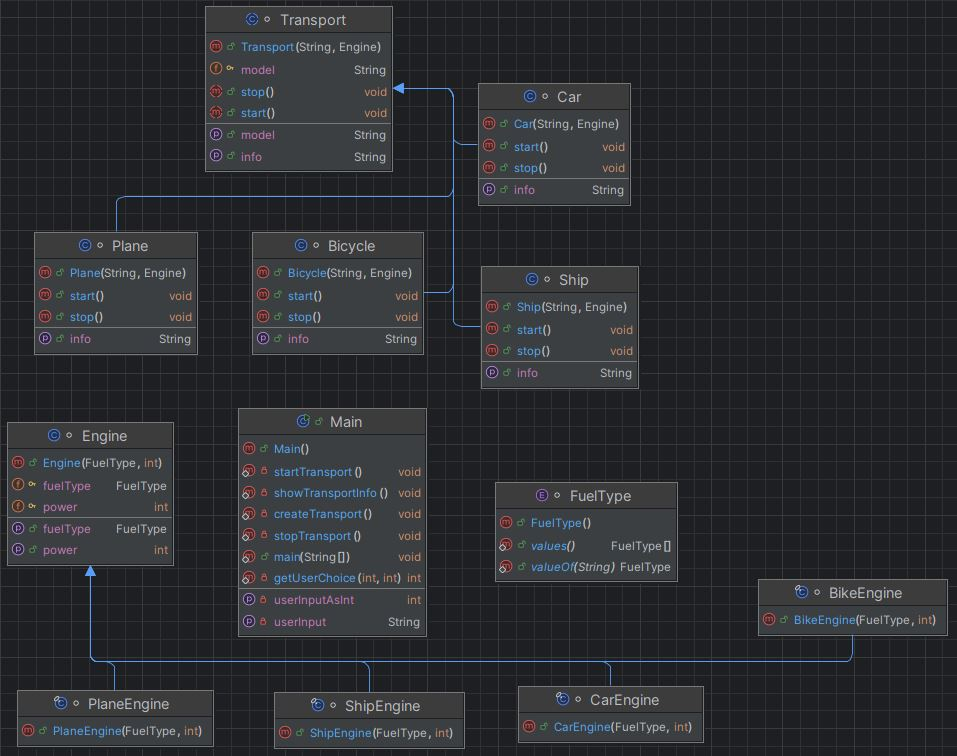

Консольная программа, где пользователю в текстовом формате предстоит ею управлять, цифрами для принятия решения в меню пользователя.
Пользователь может создавать различные транспортные средства определенных видов, мошностью двигателя и типа топлива.
